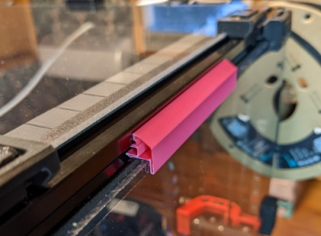
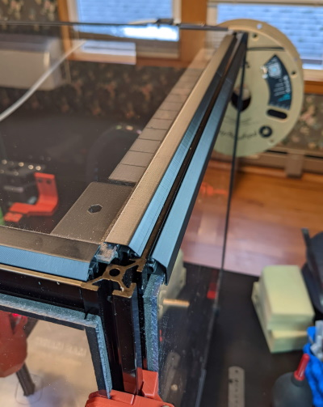
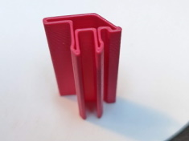

# Voron 2.4 Panel Clip
Clips for Voron panels.

Concept by zruncho (on the voron discord), tweaked by me.

As a hollow vase-mode profile they are flexible enough to easily install and remove. Yet, since they are full length, provide enough force to hold the panel snugly to the extrusion. These are optimized for formbot kit extrusions (which I think are virtually identical to misumi). Other extrusions may require tweaking the flange separation to get the right balance of ease of insertion/removal and holding power.

* For 3.5 mm thickness (2.5 mm panel with 1 mm foam)
* For 5.5 mm thickness (2.5 mm panel with 3 mm foam)

Printing:
- Vase mode with no top or bottom layers
- .6 mm extrusion width
- .25 mm layer height (I'm sure other heights will work)
- Stretch z to your heart's desire. I have printed a bunch at over 200 mm. Two of these will more than span a V2.4 300 panel.
- Brim to hold it down. If you do print a bottom layer on it, it will need to be removed to get the necessary flexibility for easy installation and removal.

With a stealthburner on a V2.4 I am able to print these in ABS at 50mm/s with 100% fan. That's greater than 10mm per minute.

